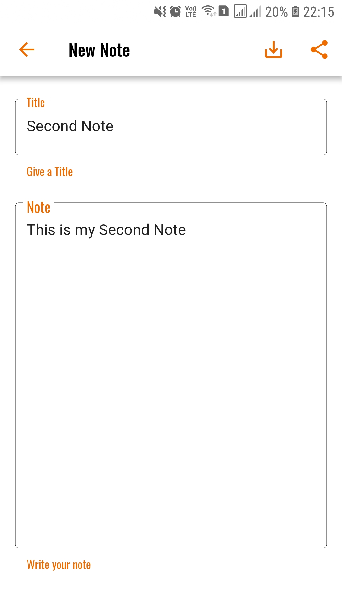
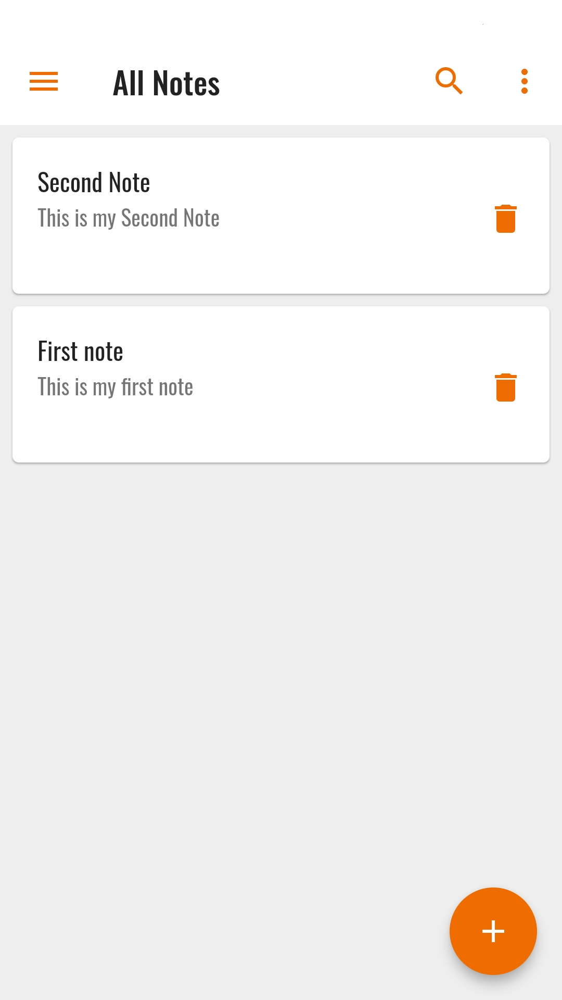
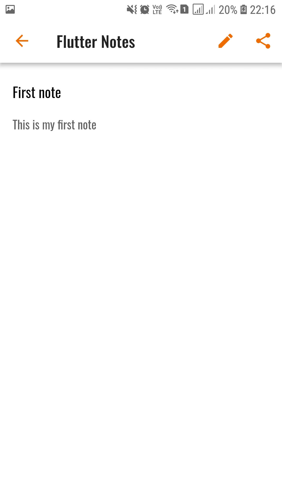
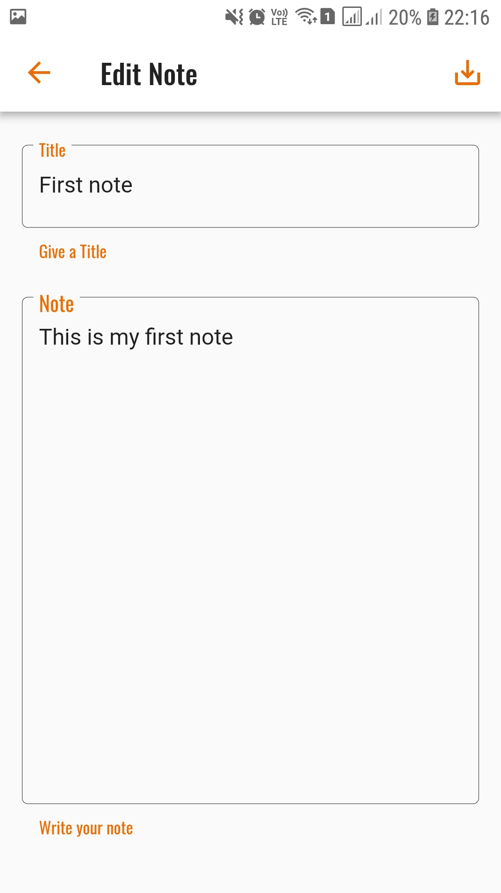

# Flutter Notes

### :heart: Star :heart: the repo to support the project or :smile:[Follow Me](https://github.com/AyushBherwani1998).Thanks!

### You will learn: 
1 | 2 | 3 | 4 | 5
--- | --- | --- | --- | ---
Sqflite | Card widget | FutureBuilder | Some Basic Widgets | Navigation & routing

### Package & Plugins Used

Sqflite: https://pub.dartlang.org/packages/sqflite  
Share: https://pub.dartlang.org/packages/share  
FlutterStatusBarColor: https://pub.dartlang.org/packages/flutter_statusbarcolor  
Path provider: https://pub.dartlang.org/packages/path_provider  

### Tutorials & Documentation

1. Sqflite Tutorial: https://medium.com/@rajajawahar77/sqflite-database-in-flutter-c0b7be83bcd2  
2. Navigation & Routing: https://flutter.io/docs/development/ui/navigation  
3. Card: https://docs.flutter.io/flutter/material/Card-class.html  
4. ListTile: https://docs.flutter.io/flutter/material/ListTile-class.html

### Known Issue

1. The labelText in TextField is always aligned to Center and it doesnot look nice. The issue has been closed in Flutter Repo but I'm still not able to use the property <strong>alignLabelWithHint: true</strong> 
Link to Issue: https://github.com/flutter/flutter/issues/18081

### ScreenShots

<h4>1</h4>

<h4>2</h4>

<h4>3</h4>

<h4>4</h4>

